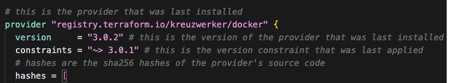

# Terraform Remote State with LocalStack S3 Backend

This directory demonstrates how to configure Terraform to use a remote S3 backend with LocalStack for local development and testing.

## Prerequisites

- Docker and Docker Compose installed
- Terraform installed
- AWS CLI installed
- jq installed (for JSON parsing)

## Step-by-Step Guide

### 1. Spin up Local S3 using LocalStack

First, you need to start LocalStack to simulate AWS services locally. From the project root directory:

```bash
# Start LocalStack using Docker Compose
docker-compose up -d

# Verify LocalStack is running
docker-compose ps
```

LocalStack will be available at `http://localhost:4566` and will simulate AWS services including S3.

### 2. Use AWS CLI Profile Override

If you have existing AWS CLI credentials configured (like SSO), you need to override them for LocalStack:

```bash
# Set environment variables to override AWS credentials
export AWS_ACCESS_KEY_ID=test
export AWS_SECRET_ACCESS_KEY=test
export AWS_DEFAULT_REGION=us-east-1
```

Alternatively, you can create a dedicated LocalStack profile:

```bash
# Configure a LocalStack profile
aws configure --profile localstack
# AWS Access Key ID: test
# AWS Secret Access Key: test
# Default region name: us-east-1
# Default output format: json

# Then use the profile in subsequent commands by adding: --profile localstack
```

### 3. Create S3 Bucket for Remote State

Create the S3 bucket that will store your Terraform state:

```bash
aws --endpoint-url=http://localhost:4566 s3api create-bucket --bucket tf-remote-state
```

### 4. Validate Bucket Creation

List all buckets to confirm the bucket was created successfully:

```bash
aws --endpoint-url=http://localhost:4566 s3api list-buckets --query "Buckets[].Name" --region us-east-1
```

You should see `tf-remote-state` in the output.

### 5. Initialize and Apply Terraform

Navigate to the remote_state directory and run:

```bash
# Initialize Terraform with the S3 backend
terraform init

# Apply the configuration to create resources and store state remotely
terraform apply
```

This will:
- Initialize Terraform with the S3 backend configuration
- Create a local file resource (`shared.txt`)
- Store the Terraform state in the remote S3 bucket

### 6. Verify Remote State Creation

List the objects in the S3 bucket to see the remote state file:

```bash
aws --endpoint-url=http://localhost:4566 s3api list-objects-v2 --bucket tf-remote-state --query "Contents[].Key" --output text
```

You should see `state/terraform.tfstate` in the output.

### 7. View Remote State Content

Download and view the content of the remote state file:

```bash
aws --endpoint-url=http://localhost:4566 s3 cp s3://tf-remote-state/state/terraform.tfstate - | jq
```

This will display the Terraform state file in JSON format, showing all managed resources and their current state.

## Configuration Details

### Backend Configuration
- **Bucket**: `tf-remote-state`
- **Key**: `state/terraform.tfstate`
- **Region**: `us-east-1`
- **Endpoint**: `http://localhost:4566` (LocalStack)

### Resources
- **local_file.shared**: Creates a local file with content "This state is stored remotely!"

## Cleanup

To clean up the resources:

```bash
# Destroy Terraform resources
terraform destroy

# Stop LocalStack
docker-compose down

# Remove LocalStack volumes (optional)
docker-compose down -v
```

## Benefits of Remote State

1. **Collaboration**: Multiple team members can work with the same state
2. **Locking**: Prevents concurrent modifications
3. **Backup**: State is stored safely in S3
4. **Security**: State can be encrypted and access-controlled

## Troubleshooting

### Common Issues

1. **LocalStack not running**: Ensure Docker is running and LocalStack container is up
2. **AWS CLI not configured**: The configuration uses test credentials, no real AWS setup needed
3. **Permission issues**: Make sure LocalStack has proper permissions to create files

### Useful Commands

```bash
# Check LocalStack logs
docker-compose logs localstack

# Reset LocalStack data
docker-compose down -v && docker-compose up -d

# Check Terraform state
terraform state list
terraform state show local_file.shared
``` 

# A Word About The Lock File (.terraform.lock.hcl)
- Its a good practice commiting terraform lock file into your repository. 
- This file locks each provider in a single version that was last installed - so all members working on this projects are aling to it.
- It is also serves as a record of who committed the version chagne.
